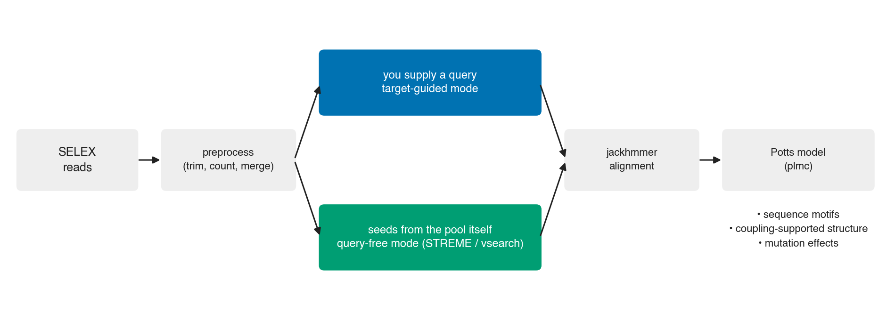
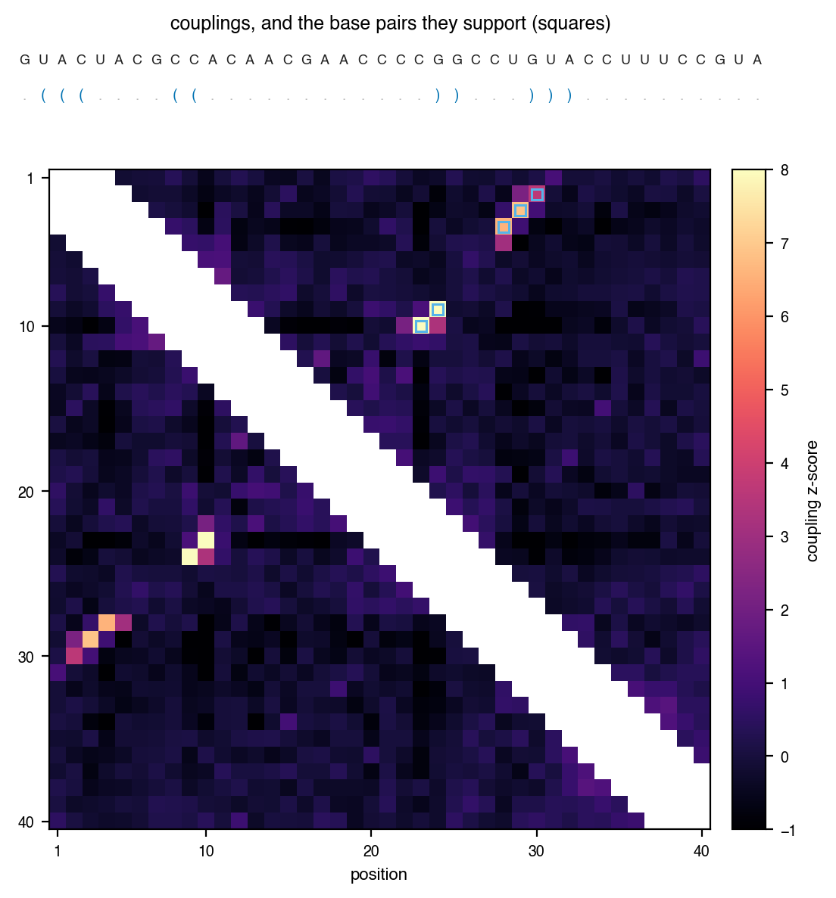

# RaptCouple

RaptCouple learns a maximum-entropy (Potts) model from SELEX sequencing data and reads three
things off it: the **sequence motifs** a selection converged on, the **secondary structure**
supported by covariation between positions, and the **effect of mutations** on fitness. It
uses no thermodynamic parameters, so it also applies to aptamers and ribozymes built from
modified nucleotides, for which folding parameters are unavailable or unreliable.



There are two ways to run it. In **target-guided** mode you supply a query sequence and the
alignment is built around it. In **query-free** mode the queries are generated from the pool
itself — from motifs found by STREME, or from abundant clusters found by vsearch — so no
prior knowledge of the motif is needed.

# Installation

```bash
mamba env create -f environment.yaml
conda activate raptcouple
```

**plmc must be installed separately** ([debbiemarkslab/plmc](https://github.com/debbiemarkslab/plmc)).
Build it, then set `PATH_TO_PLMC` at the top of `src/plmc.py` to the binary.

Everything else — HMMER, cutadapt, FASTAptamer, STREME (MEME Suite), vsearch — comes with the
environment.

# Quick start

The repository ships trained models, so you can see what RaptCouple produces before running
anything on your own data:

```bash
python example/reproduce/01_structure_from_couplings.py   # fold a model
python example/reproduce/02_deletion_effects.py           # score mutations
python example/reproduce/03_motif_candidates.py           # extract motif candidates
```

Each runs in seconds and reproduces a published result; the first two assert the values from
the paper, so they fail if the result changes. See `example/reproduce/README.md`.



*Couplings of the Ishida2020 2'-F aptamer. Squares mark the pairs that survive folding: only
couplings with a z-score of at least 3, and only pairs stacked on a neighbouring pair.*

# Pipeline

Every step reads the same config YAML. `example/Ishida2020/config_6R_rank1.yaml` is a
complete one and `example/template.yaml` is a blank to copy;
`example/Ishida2020/Ishida2020.ipynb` walks through the whole workflow.

| Step | Command | Output |
|---|---|---|
| 1. Preprocess | `merge_and_cutadapt_all_rounds.py --config <yaml>` | one merged, annotated FASTA |
| 2. Alignment | `run_jackhmmer.py --config <yaml>` | `.msa` |
| 3. Train | `train_potts.py --config <yaml>` | `.model_params`, `.coupling` |
| 4. Fold | `fold_by_coupling.py --coupling <.model_params> --output <json>` | secondary structure |
| 5. Mutations | `predict_mutation_effects.py --param_file <.model_params> --mutations G1A,A21.` | energy changes |

Steps 2 and 3 can be replaced by `run_query_free.py`, which generates the queries itself.

## 1. Preprocessing

Raw FASTQ files can be downloaded from [SRA](https://www.ncbi.nlm.nih.gov/sra). Convert them
into one FASTA per SELEX round:

```
data_dir/
├── 2nd_round.fa
├── 3rd_round.fa
├── 4th_round.fa
├── 5th_round.fa
└── 6th_round.fa
```

```yaml
Preprocess_parameters:
  N_random: 40
  adapter_3: TATGTGCGCATACATGGATCCTC
  adapter_5: TAATACGACTCACTATAGGGAGAACTTCGACCAGAAG
  data_dir: ./where_the_data_is
  fasta_annotation:
    2nd_round.fa: 2R
    3rd_round.fa: 3R
    4th_round.fa: 4R
    5th_round.fa: 5R
    6th_round.fa: 6R
  # remove_lowcount:   # optional: drop sequences seen fewer times than this
  #   2nd_round.fa: 1
  #   3rd_round.fa: 1
```

```bash
python scripts/merge_and_cutadapt_all_rounds.py --config ./example/Ishida2020/config_6R_rank1.yaml
```

Adapters are trimmed with cutadapt, reads are counted and deduplicated with FASTAptamer, and
the rounds are merged into one file. Each header records the round, rank, read count and RPM,
which later steps use to rank candidates by abundance.

## 2. Alignment

```yaml
MSA_parameters:
  all_fasta: ./example/Ishida2020/data/Ishida2020.count.ann.all_selex.unique.fa
  target_id: Ishida2020-6R-1-2626-55264.43-0
  save_dir: ./example/Ishida2020/outputs
  prefix: ""
  iters: 10
  F1: 0.02
  F2: 0.001
  F3: 0.0001
  T: 5
  domT: 5
  incT: 5
  incdomT: 5
  print_result: true
```

```bash
python scripts/run_jackhmmer.py --config ./example/Ishida2020/config_6R_rank1.yaml
```

`target_id` is the query: the header of the read the alignment is built around. These
settings work for most SELEX data; if the alignment comes out too shallow, relax the
jackhmmer parameters (`iters`, `F1`, `F2`, `F3`, `T`, `domT`, `incT`, `incdomT`). See the
HMMER3 user guide for what they mean.

## 3. Potts model

```yaml
Potts_parameters:
  input_fasta: ./example/Ishida2020/outputs/Ishida2020-6R-1-2626-55264.43-0.msa
  sim_threshold: 0.05   # theta: reweighting of similar sequences
  vocab: AUGC.
  iters: 200
  suffix: ""
  print_result: true
```

```bash
python scripts/train_potts.py --config ./example/Ishida2020/config_6R_rank1.yaml
```

`sim_threshold` down-weights near-identical sequences; lower it when the alignment is very
redundant. Training writes a `.model_params` binary holding the target sequence, the
alphabet, the fields `hi`, the couplings `Jij`, and their Frobenius norms with average
product correction (`FN_apc`):

```python
from src.plmc import read_params
params = read_params("example/Ishida2020/outputs/Ishida2020-6R-1-2626-55264.43.model_params")
```

## 4. Folding

Base pairs are placed only where the APC-corrected coupling z-score reaches `--z_threshold`
(3 by default). The default **no-lonely-pair (noLP)** Nussinov algorithm additionally
requires every retained pair to be stacked on a neighbouring pair, so isolated pairs — which
a covariation signal alone does not support — are not reported.

```bash
python scripts/fold_by_coupling.py \
  --coupling ./example/Ishida2020/outputs/Ishida2020-6R-1-2626-55264.43.model_params \
  --min_loop_len 3 --z_threshold 3 \
  --output ./example/Ishida2020/outputs/fold.json
```

Add `--no-nolp` to allow isolated base pairs, as earlier versions did.

## 5. Mutation effects

```bash
python scripts/predict_mutation_effects.py \
  --param_file ./example/Ishida2020/outputs/Ishida2020-6R-1-2626-55264.43.model_params \
  --mutations G1A,A21.
```

A mutation is written `<from><position><to>`, 1-based, in the model's own alphabet; `.` is
the gap state, so `A21.` scores deleting position 21. Several mutations in one argument are
evaluated together, including the couplings between them, so the result is not the sum of
their individual effects. Use `--mutations_file` for one mutation per line.

## Query-free analysis

To run without supplying a query, replace steps 2 and 3 with:

```bash
python scripts/run_query_free.py --config <yaml> --arm streme  --out <dir>
python scripts/run_query_free.py --config <yaml> --arm vsearch --out <dir>
```

Seeds come from STREME motifs or from vsearch clusters; each seed then goes through the same
jackhmmer and Potts steps, and the motif candidates and structure are extracted from the
trained model. `results.tsv` holds one row per candidate. All settings are optional:

```yaml
Query_free_parameters:
  n_seeds: 10          # STREME motifs, or vsearch clusters, to use
  identity: 0.7        # vsearch clustering identity
  abundance_round: 6   # count reads from this round only (default: the latest)
  top_n: 3             # candidates kept per seed, by prevalence
```

Candidate extraction is also available on its own, for models you already have:

```python
from src.plmc import read_params
from src import motif

params = read_params("example/Jolma2020/outputs/117_RBM4_TTCGGA40NCGC_AAG_4-997-17-72.02-44.model_params")
for candidate in motif.candidates(params):
    print(candidate["consensus"], candidate["core_kmer"])
```

## Sampling

Draw sequences from a trained model, either by Gibbs sampling or by simulated annealing
towards low-energy (high-fitness) sequences:

```bash
python scripts/gibbs_sampling.py --param_file <.model_params> > samples.fa
python scripts/simulated_annealing.py --param_file <.model_params> > annealed.fa
```

# Repository layout

```
src/         library
  plmc.py        train and read Potts models; coupling scores with APC
  potts.py       PottsModel: energies, mutation effects, sampling
  structure.py   Nussinov folding, with and without the noLP constraint
  hmmer.py       jackhmmer/nhmmer wrappers, alignment I/O
  motif.py       motif candidates from a trained model
  seeds.py       query-free seed selection (STREME, vsearch)
  util.py        sequence encoding
scripts/     command-line entry points, one per pipeline step
example/     datasets with their configs and trained models
  reproduce/     short scripts that reproduce published results
figures/     notebooks for the figures of the paper
docs/        README figures (docs/make_figures.py regenerates them)
```

Several modules run their own checks when executed directly, for example
`python src/structure.py`, `python src/motif.py` or `python src/seeds.py`.

## Datasets

`example/` carries the config and the trained models for each dataset analysed in the paper,
so any of them can be used as a starting point. Raw SELEX FASTA files are not included; place
them under the path given by `data_dir` in the config.

| Directory | Selection |
|---|---|
| `Ishida2020/` | 2'-F-modified aptamer against integrin alpha-V beta-3 |
| `Adachi2024/` | aptamer selection with a reported deletion analysis |
| `Jolma2020/` | 93 RNA-binding-protein selections (models only) |
| `Laverty2023/` | 23 RNA-binding-protein selections |
| `Methylation/` | in-house N1-methylpseudouridine methylation ribozyme |
| `PRJDB19138/`, `PRJDB19139/` | aptamer selections |
| `PRJDB19140/`, `PRJDB19141/` | doped SELEX (3% and 8%) |

# Citation

If you use this code, please cite the following paper:

```bibtex
@article{sumi2025raptcouple,
  title={Discovering structural and functional landscapes of nucleic acids through in vitro evolution},
  author={Sumi, Shunsuke and Kawahara, Daiki and Hada, Yuki and Yoshii, Tatsuyuki and Adachi, Tatsuo and Saito, Hirohide and Hamada, Michiaki},
  journal={submitted},
  volume={XX},
  number={YY},
  pages={ZZ-ZZ},
  year={2025},
  note={Correspondence should be addressed to: mhamada@waseda.jp, hirosaito@iqb.u-tokyo.ac.jp}
}
```

# License

Released under the MIT License; see [LICENSE](LICENSE).
